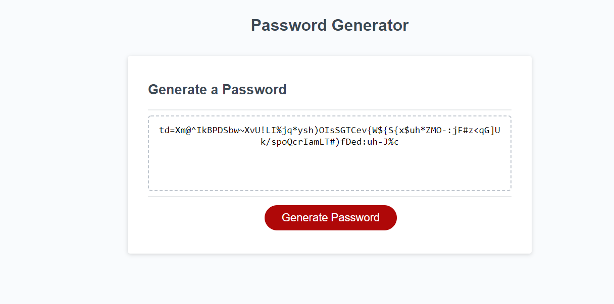

# Password_Gen

Pirooz Wallace
10/17/20

Contact Info: PiroozWallace@outlook.com

LinkedIn: www.linkedin.com/in/piroozwallace

GitHub Repo:
https://github.com/attack-theoRy/03Password_Gen

Github Pages / Deployed App:
https://attack-theory.github.io/03Password_Gen/index.html

Javascript Password Generator

Technologies Used:
- Javascript
- HTML / CSS

Creates a random password between 8 and 128 characters long using criteria from the user including uppercase, lowercase, numbers and/or characters. Password will have at least one character from each criteria.  User is asked how long the password is and the program checks to see if they input a number between 8 and 128. Currently I don't have a way of error checking someone putting in a non-number, but it does put bounds on the length of the password. Password is output to the textbox.

MIT License
-----------

Copyright (c) 2020 Pirooz Wallace (https://attack-theory.github.io/Portfolio/index.html)
Permission is hereby granted, free of charge, to any person
obtaining a copy of this software and associated documentation
files (the "Software"), to deal in the Software without
restriction, including without limitation the rights to use,
copy, modify, merge, publish, distribute, sublicense, and/or sell
copies of the Software, and to permit persons to whom the
Software is furnished to do so, subject to the following
conditions:

The above copyright notice and this permission notice shall be
included in all copies or substantial portions of the Software.

THE SOFTWARE IS PROVIDED "AS IS", WITHOUT WARRANTY OF ANY KIND,
EXPRESS OR IMPLIED, INCLUDING BUT NOT LIMITED TO THE WARRANTIES
OF MERCHANTABILITY, FITNESS FOR A PARTICULAR PURPOSE AND
NONINFRINGEMENT. IN NO EVENT SHALL THE AUTHORS OR COPYRIGHT
HOLDERS BE LIABLE FOR ANY CLAIM, DAMAGES OR OTHER LIABILITY,
WHETHER IN AN ACTION OF CONTRACT, TORT OR OTHERWISE, ARISING
FROM, OUT OF OR IN CONNECTION WITH THE SOFTWARE OR THE USE OR
OTHER DEALINGS IN THE SOFTWARE.
		
English Česky

